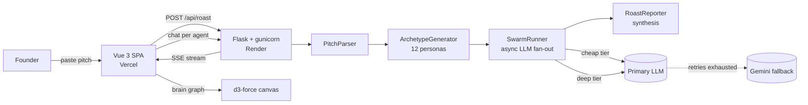
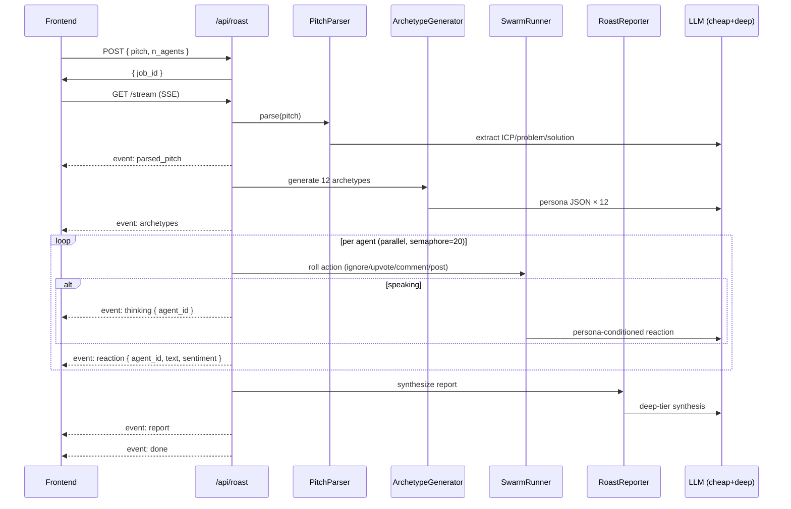
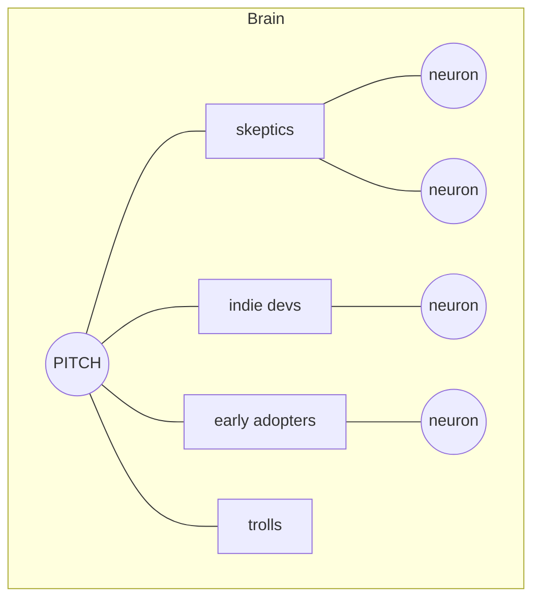
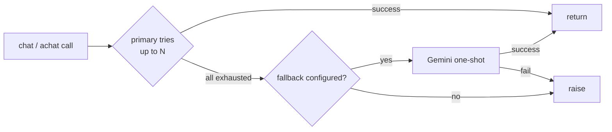
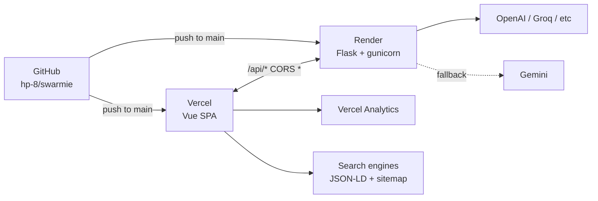

# Swarmie — Case Study

> Founder validation through grounded AI swarm simulation. Paste a pitch, watch 500 AI users react like a Reddit thread, and walk away with the three real objections before you burn a single user interview.

**Live:** [swarmie.vercel.app](https://swarmie.vercel.app)
**Repo:** [github.com/hp-8/swarmie](https://github.com/hp-8/swarmie)
**Stack:** Vue 3 · Flask · OpenAI-compat LLMs · d3-force · Remotion · Vercel · Render

---

## The problem

Founders spend $10k on user interviews — or six months on the wrong positioning — to discover the same three objections a roomful of strangers would have raised in fifteen minutes. The signal exists; the access doesn't.

## The bet

A pre-interview filter. Not a replacement for talking to real users — a way to kill seventeen bad positionings before you embarrass yourself with the eighteenth.

## What it does

1. Founder pastes a pitch (deck text, landing copy, half a tweet).
2. The system parses ICP, problem, solution, pricing.
3. A swarm of 100–500 LLM-driven personas reacts in character — post, comment, upvote, ignore — with distinct tones and objection biases.
4. A reporter synthesizes top objections, sentiment split, PMF score (0–10), per-ICP fit, and messaging gaps.
5. The founder can click any reacting agent, see its persona and reasoning, and **chat with it** to dig deeper.

The whole loop lands in ~60 seconds.

---

## System architecture

The pipeline is intentionally **stateless and in-process**. No DB, no Redis. A 60-second job lives in a Python dict keyed by `job_id` and dies with the process. This keeps the free-tier deploy under 512 MB and lets every stage stream over a single SSE connection.

---

## The pipeline, one frame at a time

Key tradeoffs baked in:

- **Action roll before LLM call.** ~60% of agents `ignore` and cost zero tokens — matches real social-media base rates.
- **Two-tier model routing.** ~80% reactions go to a cheap model (Haiku / Llama-3 / Gemini Flash); ~20% "influencer" agents get a deep model. Synthesis is always deep.
- **Hard cost ceiling.** A watchdog cancels mid-run if cumulative spend exceeds `ROAST_MAX_COST_USD`.
- **SSE, not polling.** The frontend gets `thinking` *and* `reaction` events so the UI can light up before the text lands.

---

## The brain graph — making the swarm legible

Founders don't trust black boxes. The "brain" view is a live `d3-force` canvas simulation:

- **Root node** = pitch.
- **8 archetype satellites** = ICP segments, color-coded.
- **240+ neurons** orbit their parent archetype.
- Each neuron **pulses amber** the moment its LLM call fires; settles to **green/red** based on sentiment.
- Hover a neuron → its persona. Click → drawer with reaction, biases, and a chat box.

The graph reuses the **same SSE stream** the list view consumes — no extra backend work. Total cost: ~300 LOC in a single Vue component.

---

## Talk to the neuron

Click an agent → ask a follow-up question. The reply stays in character, grounded in the agent's persona and original reaction.

Design notes:

- **No vector DB, no Zep.** History lives in a per-job in-memory dict. The last ten turns are stuffed into the prompt; that's enough at this scope.
- **Soft 10-turn cap.** Past that, a paywall card surfaces. The mechanic doubles as a natural monetization hook.
- **Free-tier-friendly.** Average chat turn ≈ 200 tokens out → costs cents per session.

---

## LLM resilience — the fallback layer

The OpenAI SDK targets a configurable `base_url`, so the same code talks to OpenAI, OpenRouter, Groq, Together, Ollama, or Gemini (via its OpenAI-compatible endpoint).

Set `LLM_FALLBACK_API_KEY` and the client transparently retries via Gemini after the primary exhausts retries. Usage is tracked under `<tier>/fallback` so cost reporting stays accurate.

---

## The promo — Remotion + ffmpeg

Built a 14-second motion-graphics intro entirely in React via **Remotion**.

| Scene | Beats |
|-------|-------|
| 0–2s · chaos | 30 comment bubbles spring in from a jittered grid |
| 2–5s · activation | Pitch card lifts, 80 nodes bloom radially with a screen-shake |
| 5–9s · dashboard | 9 panels stagger in — objections, sentiment, PMF 7.4, live feed, 120-persona grid, ICP fit, KPIs |
| 9–12s · convergence | 120 colored particles ease-bezier toward center; logo materializes |
| 12–14s · hold | Tagline, gentle push-in, ambient float |

Each scene is wrapped in a **camera** component that animates `scale`, `pan`, `rotate`, and a one-shot shake at "activation". A procedural soundtrack — bass + pad + hi-hat + sub-kick — was synthesized with `ffmpeg` `lavfi` filters and amix'd to a single 14s mp3, baked in via `<Audio />`.

Rendered to mp4 (h264) + webm (vp9), served from `frontend/public/`, embedded on the hero with poster fallback for `prefers-reduced-motion`.

---

## Trust layer — the AI disclosure

Meta-style placement. An ⓘ icon next to every claim ("PMF · /10"), a single `<AiDisclosure>` Vue component, one shared modal:

> Every reaction, score, and quote on this page was produced by a swarm of AI language models role-playing personas. **No real humans were surveyed.**

Definition rows: what it is · what it isn't · how the swarm thinks · known limits · cost & privacy. Closes with: "Use the signal to decide what to *ask real users next* — not to skip them."

Subtle by default, one click for the full read. Same component everywhere — Home, PitchInput, Watching, Result.

---

## Deployment topology

- **Frontend** → Vercel. Static Vue SPA, immutable cache headers on the promo video.
- **Backend** → Render free tier. Slim `requirements-prod.txt` (10 packages, ~25 MB) instead of the legacy 200-MB OASIS + camel-ai stack; `try/except` guards around legacy imports keep the slim install bootable.
- **Secrets** managed in Render dashboard via `sync: false` blueprint flags.
- **Analytics** = Vercel Web Analytics — no cookies, no third-party JS.
- **SEO** = og:image of the promo poster, Twitter cards, `SoftwareApplication` JSON-LD, `robots.txt` excluding job-scoped routes, `sitemap.xml`.

---

## Engineering notes worth flagging

| Decision | Why |
|---|---|
| In-memory job store (no DB) | 60-second jobs. A DB would be cargo-culted complexity. |
| SSE over WebSockets | One-way server-push fits the use case. Plays nice with Render free tier and HTTP/2. |
| `services/__init__.py` blanked | Re-exporting heavy modules at package load crashed slim prod installs. Submodules import directly now. |
| `wsgi.py` fails fast on missing keys | Surfaces misconfig in Render deploy logs instead of a 500 at first request. |
| Camera as a wrapper, not per-element | Keeps Remotion scenes legible; transforms compose cleanly. |
| Procedural music in ffmpeg | Zero licensing surface for an open-source project. |
| Vue Router history mode + Vercel rewrite | All routes serve `index.html`; brain view URLs are shareable. |

---

## Outcome

| Metric | Value |
|---|---|
| **Pipeline runtime** | ~60s for 100 agents, ~3min for 500 |
| **Cost per run** | $0.0012 – $0.50 (capped) on hosted; **$0 on local Ollama** |
| **First contentful paint** | < 0.5s (Vercel edge + 27 KB gzipped CSS) |
| **Promo video weight** | 4.5 MB mp4 / 4.5 MB webm — autoplay muted loop |
| **Slim backend image** | ~80 MB resident vs. ~1.2 GB for the legacy MiroFish stack |
| **LLM resilience** | Primary + retries + Gemini fallback in a single call site |

---

## What this project shows

- **Full-stack judgement.** Picked the right level of complexity per layer — no DB where a dict works, SSE where polling would feel cheap, a custom canvas graph where vue-flow would have looked templated.
- **Cost-aware AI engineering.** Tiered model routing, action-roll-before-call sampling, watchdog cancellation, fallback provider, prompt-cache friendly shapes.
- **Design that earns trust.** Hallmark-themed UI, AI disclosure modal, Meta-style subtlety, motion that serves the story.
- **Ship-to-prod fluency.** Two hosts, blueprint-managed infra, analytics, SEO, sitemap, JSON-LD, og: + twitter cards, all wired in one session.
- **Brand-grade craft.** A 14-second Remotion promo with synthesized music, camera moves, and per-scene composition — built in the same week as the product.

---

## Quick links

- **Try it:** [swarmie.vercel.app](https://swarmie.vercel.app)
- **Source:** [github.com/hp-8/swarmie](https://github.com/hp-8/swarmie)
- **Hero promo:** [swarmie.vercel.app/swarmie-promo.mp4](https://swarmie.vercel.app/swarmie-promo.mp4)
- **Backend health:** [swarmie-backend.onrender.com/health](https://swarmie-backend.onrender.com/health)

---

<em>Built by Harsh Patadia · AGPL-3.0 · 2026</em>
