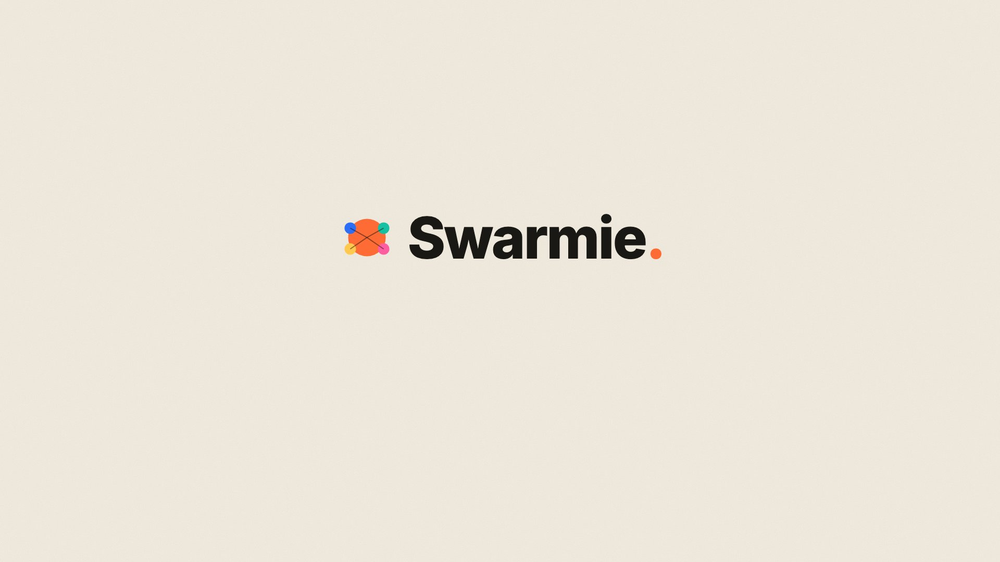

<div align="center">

# 🐝 Swarmie

**Roast your startup with 500 AI users in 60 seconds.**

Founder validation through AI swarm simulation. Paste a pitch and watch 100–500 AI users react like a real Reddit / HN / Product Hunt thread — objections, questions, snark, and silence — then walk away with a **decision brief**: ship, sharpen, or kill, plus the exact questions to ask real users next.

[](https://swarmie.vercel.app)
[](https://www.gnu.org/licenses/agpl-3.0)
[](./CONTRIBUTING.md)
[]()

**👉 Try it live: [swarmie.vercel.app](https://swarmie.vercel.app)**

<br />

<video src="https://github.com/hp-8/swarmie/raw/main/frontend/public/swarmie-promo.mp4" autoplay loop muted playsinline width="820">
  <a href="./frontend/public/swarmie-promo.mp4">
    
  </a>
</video>

<sub><em>Pitch in → 500 AI users react → insights out. 14s demo · <a href="./frontend/public/swarmie-promo.mp4">download mp4</a></em></sub>

</div>

---

## Why Swarmie

Before you spend $10k on user interviews or burn 6 months on the wrong positioning, **find your top 3 objections in 60 seconds**.

Swarmie isn't a replacement for talking to real users. It's a **pre-interview filter** — kill 17 bad positionings before you embarrass yourself with the 18th.

**Built for**:
- Pre-launch founders validating a pitch
- PMs A/B testing positioning before a launch
- Marketers stress-testing landing-page copy
- Indie hackers without a panel of real users to call

---

## How It Works

1. **Paste** your pitch (problem / product / audience / pricing / competitors).
2. Swarmie parses it, then builds a swarm of 100–500 agents with distinct personas, biases, and tone.
3. Agents react: post, comment, upvote, ask questions, raise objections — or scroll past. ~60% ignore (matching real social base rates) and cost zero tokens.
4. You get a **decision brief**, not a vanity score:
   - **Verdict** — `ship it` / `sharpen` / `wrong audience` / `kill`, with a confidence band.
   - **Next action** — the single most important move before writing more code.
   - **Top objections** — each with the exact question to ask 5 real users, a kill-criteria, and a suggested fix.
   - **Why they scrolled past** — clustered, decision-useful reasons the silent majority ignored you.
   - Supporting signal: sentiment split, per-ICP fit, messaging gaps.
5. Click any agent to read its persona and **chat with it**. Thumbs-up/down each objection to train the swarm.

Powered by:
- A lean, in-process **async LLM swarm** (no heavy simulation deps) with a hard cost ceiling.
- **Two-tier model routing** (cheap reactions / deep agents + synthesis) and a transparent **Gemini fallback**.
- Any OpenAI-compatible LLM (OpenAI, Anthropic via OpenRouter, Groq, Together, DeepSeek, **Ollama for local/free**).
- **Supabase** for privacy-light analytics, run history, and feedback (optional).

---

## Quick Start

### Prerequisites

| Tool | Version | Check |
|------|---------|-------|
| Node.js | 18+ | `node -v` |
| Python | 3.11 – 3.12 | `python --version` |
| uv | latest | `uv --version` |

### Setup

```bash
# 1. Clone
git clone https://github.com/hp-8/swarmie.git
cd swarmie

# 2. Configure
cp .env.example .env
# edit .env — add your LLM_API_KEY (required).
# Optional: LLM_FALLBACK_API_KEY (Gemini fallback), ROAST_MAX_COST_USD (cost cap),
# VITE_SUPABASE_URL + VITE_SUPABASE_ANON_KEY (analytics + feedback).
# Leave LLM_API_KEY pointed at a local Ollama to run for $0.

# 3. Install everything
npm run setup:all

# 4. Run
npm run dev
```

Open **http://localhost:3000**. Backend runs on `:5001`.

### Docker

```bash
cp .env.example .env
docker compose up -d
```

---

## Status

🚧 **Alpha.** Forked from [MiroFish](https://github.com/666ghj/MiroFish) — a Chinese-language swarm-prediction engine — and pivoted toward founder validation, then rebuilt on a slim in-process LLM swarm (the heavy OASIS/Zep stack is legacy, import-guarded, and no longer required).

**Shipped:** end-to-end 60s pipeline · decision-brief output (verdict + per-objection user-tests + kill-criteria) · "why they scrolled past" silence analysis · per-agent chat · two feedback layers (per-objection votes + product feedback) feeding calibration · atmospheric, fully-responsive marketing site · PDF export · Supabase analytics.

**In development:** live grounding in real Reddit/HN/review chatter, public backtest calibration, and the paid tiers (live voice interviews, continuous monitoring, real-user bridge).

See **[ROADMAP.md](./ROADMAP.md)** for what's coming.

---

## What's Different from MiroFish

Swarmie keeps MiroFish's strong sim core (OASIS + Zep + multi-step pipeline) but pivots:

| Dimension | MiroFish | Swarmie |
|-----------|----------|---------|
| **Audience** | General prediction (news, novels, policy) | Pre-launch founders |
| **Input** | Any seed document | Pitch / deck / one-pager |
| **Output** | Long-form prediction report | Decision brief: verdict + objection user-tests + silence analysis |
| **Realism** | LLM personas from raw graph | Sampled, cited silence reasons today; live grounding (WIP) |
| **Calibration** | None | Public backtest scoreboard (WIP) |
| **Language** | Chinese-first | English-first |
| **Cost focus** | Frontier models | Tiered routing + local-model default |

---

## Contributing

We need help on:
- **ICP corpora** — scrape + tag Reddit/HN comments by founder-relevant segments
- **Backtest cases** — pick known startups (hits + flops), measure prediction accuracy
- **Cost optimization** — tiered model routing, archetype clustering, prompt caching
- **Founder UX** — make the "upload pitch → see report" flow brutally simple

See **[CONTRIBUTING.md](./CONTRIBUTING.md)**.

---

## License

**AGPL-3.0**. See [LICENSE](./LICENSE).

Inherited from upstream MiroFish. Network-use clause applies — if you host Swarmie as a service, you must publish your modifications.

For commercial licensing or hosted-service exceptions, open an issue.

---

## Acknowledgments

Swarmie stands on the work of:

- **[MiroFish](https://github.com/666ghj/MiroFish)** by 666ghj and team — upstream codebase
- **[OASIS](https://github.com/camel-ai/oasis)** by CAMEL-AI — agent social simulation engine (Apache 2.0)
- **[Zep](https://github.com/getzep/zep)** — agent memory + knowledge graph
- **[Shanda Group](https://www.shanda.com/)** — strategic support for original MiroFish

See **[NOTICE](./NOTICE)** for full attributions.
